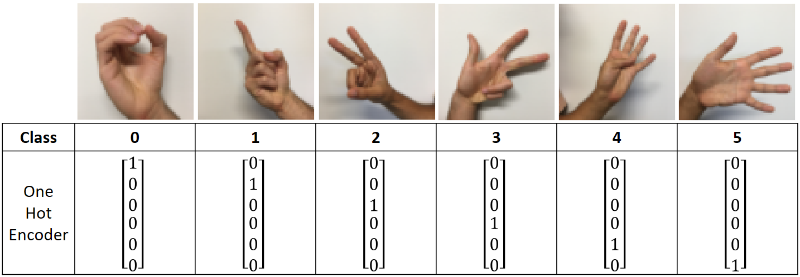
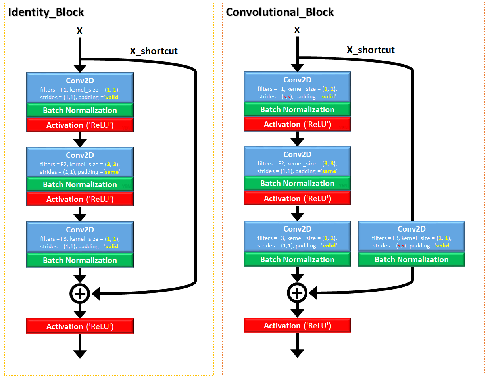

# Residual-Network-50
Ref: Deep residual networks for image recognition, He et al., 2015. https://arxiv.org/pdf/1512.03385.pdf  

 
## (Still in contruction. Not finished yet ....................)
 

## Image classification of Single-Hand-Sign

## Identity Block & Convolutional Block
Two types of blocks in the network, Identity Block (ID_Block) and Convolutional Block (Conv_Block).

### Identity Block
Input activation a^[#layer]  Dimension SAME as Output activation a^[#layer+3]  
Add input X to the next next next layer before activation.

### Convolutional Block
Input activation a^[#layer]  Dimension DIFFERENT than Output activation a^[#layer+3]  
Add input X to the next next next layer before activation. Since dimension is different, a Conv2D for X_shortcut is a must.
  
  
  
See detail of the parameters: filters, kernel_size, stride, padding

## ResNet-50
Architecture:  
Conv2D -> Batch_Norm -> ReLU -> Max_Pool  ..........(Stage 1)  
 -> Conv_Block -> ID_Block x 2  ..........................................(Stage 2)  
 -> Conv_Block -> ID_Block x 3  ..........................................(Stage 3)  
 -> Conv_Block -> ID_Block x 5  ..........................................(Stage 4)  
 -> Conv_Block -> ID_Block x 2  ..........................................(Stage 5)  
 -> AVG_Pool -> Output_Layer
 

