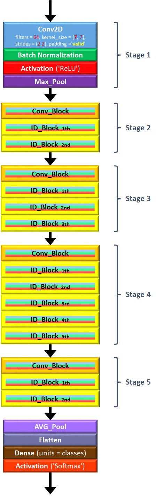

# Residual-Network-50
Ref: Deep residual networks for image recognition, He et al., 2015. https://arxiv.org/pdf/1512.03385.pdf  

 
## (Still in contruction. Not finished yet ....................)
 

## Identity Block & Convolutional Block
Two types of blocks in the network, Identity Block (ID_Block) and Convolutional Block (Conv_Block).

### Identity Block
Input activation a^[#layer]  Dimension SAME as Output activation a^[#layer+3]  
Add input X to the next next next layer before activation.

### Convolutional Block
Input activation a^[#layer]  Dimension DIFFERENT than Output activation a^[#layer+3]  
Add input X to the next next next layer before activation. Since dimension is different, a Conv2D for X_shortcut is a must.
  
  
  
See detail of the parameters: filters, kernel_size, stride, padding

## ResNet-50
Architecture:  
Conv2D -> Batch_Norm -> ReLU -> Max_Pool  ..........(Stage 1)  
 -> Conv_Block -> ID_Block x 2  ..........................................(Stage 2)  
 -> Conv_Block -> ID_Block x 3  ..........................................(Stage 3)  
 -> Conv_Block -> ID_Block x 5  ..........................................(Stage 4)  
 -> Conv_Block -> ID_Block x 2  ..........................................(Stage 5)  
 -> AVG_Pool -> Output_Layer
   
 
 

 
 

## Plot Model Summary
____________________________________________________________________________________________________
Layer (type)                     Output Shape          Param #     Connected to                     
====================================================================================================
input_3 (InputLayer)             (None, 64, 64, 3)     0                                            
____________________________________________________________________________________________________
zero_padding2d_3 (ZeroPadding2D) (None, 70, 70, 3)     0           input_3[0][0]                    
____________________________________________________________________________________________________
conv2d_107 (Conv2D)              (None, 32, 32, 64)    9472        zero_padding2d_3[0][0]           
____________________________________________________________________________________________________
batch_normalization_107 (BatchNo (None, 32, 32, 64)    256         conv2d_107[0][0]                 
____________________________________________________________________________________________________
activation_99 (Activation)       (None, 32, 32, 64)    0           batch_normalization_107[0][0]    
____________________________________________________________________________________________________
max_pooling2d_3 (MaxPooling2D)   (None, 15, 15, 64)    0           activation_99[0][0]              
____________________________________________________________________________________________________
conv2d_108 (Conv2D)              (None, 15, 15, 64)    4160        max_pooling2d_3[0][0]            
____________________________________________________________________________________________________
batch_normalization_108 (BatchNo (None, 15, 15, 64)    256         conv2d_108[0][0]                 
____________________________________________________________________________________________________
activation_100 (Activation)      (None, 15, 15, 64)    0           batch_normalization_108[0][0]    
____________________________________________________________________________________________________
conv2d_109 (Conv2D)              (None, 15, 15, 64)    36928       activation_100[0][0]             
____________________________________________________________________________________________________
batch_normalization_109 (BatchNo (None, 15, 15, 64)    256         conv2d_109[0][0]                 
____________________________________________________________________________________________________
activation_101 (Activation)      (None, 15, 15, 64)    0           batch_normalization_109[0][0]    
____________________________________________________________________________________________________
conv2d_110 (Conv2D)              (None, 15, 15, 256)   16640       activation_101[0][0]             
____________________________________________________________________________________________________
conv2d_111 (Conv2D)              (None, 15, 15, 256)   16640       max_pooling2d_3[0][0]            
____________________________________________________________________________________________________
batch_normalization_110 (BatchNo (None, 15, 15, 256)   1024        conv2d_110[0][0]                 
____________________________________________________________________________________________________
batch_normalization_111 (BatchNo (None, 15, 15, 256)   1024        conv2d_111[0][0]                 
____________________________________________________________________________________________________
add_33 (Add)                     (None, 15, 15, 256)   0           batch_normalization_110[0][0]    
                                                                   batch_normalization_111[0][0]    
____________________________________________________________________________________________________
activation_102 (Activation)      (None, 15, 15, 256)   0           add_33[0][0]                     
____________________________________________________________________________________________________
conv2d_112 (Conv2D)              (None, 15, 15, 64)    16448       activation_102[0][0]             
____________________________________________________________________________________________________
batch_normalization_112 (BatchNo (None, 15, 15, 64)    256         conv2d_112[0][0]                 
____________________________________________________________________________________________________
activation_103 (Activation)      (None, 15, 15, 64)    0           batch_normalization_112[0][0]    
____________________________________________________________________________________________________
conv2d_113 (Conv2D)              (None, 15, 15, 64)    36928       activation_103[0][0]             
____________________________________________________________________________________________________
batch_normalization_113 (BatchNo (None, 15, 15, 64)    256         conv2d_113[0][0]                 
____________________________________________________________________________________________________
activation_104 (Activation)      (None, 15, 15, 64)    0           batch_normalization_113[0][0]    
____________________________________________________________________________________________________
conv2d_114 (Conv2D)              (None, 15, 15, 256)   16640       activation_104[0][0]             
____________________________________________________________________________________________________
batch_normalization_114 (BatchNo (None, 15, 15, 256)   1024        conv2d_114[0][0]                 
____________________________________________________________________________________________________
add_34 (Add)                     (None, 15, 15, 256)   0           batch_normalization_114[0][0]    
                                                                   activation_102[0][0]             
____________________________________________________________________________________________________
activation_105 (Activation)      (None, 15, 15, 256)   0           add_34[0][0]                     
____________________________________________________________________________________________________
conv2d_115 (Conv2D)              (None, 15, 15, 64)    16448       activation_105[0][0]             
____________________________________________________________________________________________________
batch_normalization_115 (BatchNo (None, 15, 15, 64)    256         conv2d_115[0][0]                 
____________________________________________________________________________________________________
activation_106 (Activation)      (None, 15, 15, 64)    0           batch_normalization_115[0][0]    
____________________________________________________________________________________________________
conv2d_116 (Conv2D)              (None, 15, 15, 64)    36928       activation_106[0][0]             
____________________________________________________________________________________________________
batch_normalization_116 (BatchNo (None, 15, 15, 64)    256         conv2d_116[0][0]                 
____________________________________________________________________________________________________
activation_107 (Activation)      (None, 15, 15, 64)    0           batch_normalization_116[0][0]    
____________________________________________________________________________________________________
conv2d_117 (Conv2D)              (None, 15, 15, 256)   16640       activation_107[0][0]             
____________________________________________________________________________________________________
batch_normalization_117 (BatchNo (None, 15, 15, 256)   1024        conv2d_117[0][0]                 
____________________________________________________________________________________________________
add_35 (Add)                     (None, 15, 15, 256)   0           batch_normalization_117[0][0]    
                                                                   activation_105[0][0]             
____________________________________________________________________________________________________
activation_108 (Activation)      (None, 15, 15, 256)   0           add_35[0][0]                     
____________________________________________________________________________________________________
conv2d_118 (Conv2D)              (None, 8, 8, 128)     32896       activation_108[0][0]             
____________________________________________________________________________________________________
batch_normalization_118 (BatchNo (None, 8, 8, 128)     512         conv2d_118[0][0]                 
____________________________________________________________________________________________________
activation_109 (Activation)      (None, 8, 8, 128)     0           batch_normalization_118[0][0]    
____________________________________________________________________________________________________
conv2d_119 (Conv2D)              (None, 8, 8, 128)     147584      activation_109[0][0]             
____________________________________________________________________________________________________
batch_normalization_119 (BatchNo (None, 8, 8, 128)     512         conv2d_119[0][0]                 
____________________________________________________________________________________________________
activation_110 (Activation)      (None, 8, 8, 128)     0           batch_normalization_119[0][0]    
____________________________________________________________________________________________________
conv2d_120 (Conv2D)              (None, 8, 8, 512)     66048       activation_110[0][0]             
____________________________________________________________________________________________________
conv2d_121 (Conv2D)              (None, 8, 8, 512)     131584      activation_108[0][0]             
____________________________________________________________________________________________________
batch_normalization_120 (BatchNo (None, 8, 8, 512)     2048        conv2d_120[0][0]                 
____________________________________________________________________________________________________
batch_normalization_121 (BatchNo (None, 8, 8, 512)     2048        conv2d_121[0][0]                 
____________________________________________________________________________________________________
add_36 (Add)                     (None, 8, 8, 512)     0           batch_normalization_120[0][0]    
                                                                   batch_normalization_121[0][0]    
____________________________________________________________________________________________________
activation_111 (Activation)      (None, 8, 8, 512)     0           add_36[0][0]                     
____________________________________________________________________________________________________
conv2d_122 (Conv2D)              (None, 8, 8, 128)     65664       activation_111[0][0]             
____________________________________________________________________________________________________
batch_normalization_122 (BatchNo (None, 8, 8, 128)     512         conv2d_122[0][0]                 
____________________________________________________________________________________________________
activation_112 (Activation)      (None, 8, 8, 128)     0           batch_normalization_122[0][0]    
____________________________________________________________________________________________________
conv2d_123 (Conv2D)              (None, 8, 8, 128)     147584      activation_112[0][0]             
____________________________________________________________________________________________________
batch_normalization_123 (BatchNo (None, 8, 8, 128)     512         conv2d_123[0][0]                 
____________________________________________________________________________________________________
activation_113 (Activation)      (None, 8, 8, 128)     0           batch_normalization_123[0][0]    
____________________________________________________________________________________________________
conv2d_124 (Conv2D)              (None, 8, 8, 512)     66048       activation_113[0][0]             
____________________________________________________________________________________________________
batch_normalization_124 (BatchNo (None, 8, 8, 512)     2048        conv2d_124[0][0]                 
____________________________________________________________________________________________________
add_37 (Add)                     (None, 8, 8, 512)     0           batch_normalization_124[0][0]    
                                                                   activation_111[0][0]             
____________________________________________________________________________________________________
activation_114 (Activation)      (None, 8, 8, 512)     0           add_37[0][0]                     
____________________________________________________________________________________________________
conv2d_125 (Conv2D)              (None, 8, 8, 128)     65664       activation_114[0][0]             
____________________________________________________________________________________________________
batch_normalization_125 (BatchNo (None, 8, 8, 128)     512         conv2d_125[0][0]                 
____________________________________________________________________________________________________
activation_115 (Activation)      (None, 8, 8, 128)     0           batch_normalization_125[0][0]    
____________________________________________________________________________________________________
conv2d_126 (Conv2D)              (None, 8, 8, 128)     147584      activation_115[0][0]             
____________________________________________________________________________________________________
batch_normalization_126 (BatchNo (None, 8, 8, 128)     512         conv2d_126[0][0]                 
____________________________________________________________________________________________________
activation_116 (Activation)      (None, 8, 8, 128)     0           batch_normalization_126[0][0]    
____________________________________________________________________________________________________
conv2d_127 (Conv2D)              (None, 8, 8, 512)     66048       activation_116[0][0]             
____________________________________________________________________________________________________
batch_normalization_127 (BatchNo (None, 8, 8, 512)     2048        conv2d_127[0][0]                 
____________________________________________________________________________________________________
add_38 (Add)                     (None, 8, 8, 512)     0           batch_normalization_127[0][0]    
                                                                   activation_114[0][0]             
____________________________________________________________________________________________________
activation_117 (Activation)      (None, 8, 8, 512)     0           add_38[0][0]                     
____________________________________________________________________________________________________
conv2d_128 (Conv2D)              (None, 8, 8, 128)     65664       activation_117[0][0]             
____________________________________________________________________________________________________
batch_normalization_128 (BatchNo (None, 8, 8, 128)     512         conv2d_128[0][0]                 
____________________________________________________________________________________________________
activation_118 (Activation)      (None, 8, 8, 128)     0           batch_normalization_128[0][0]    
____________________________________________________________________________________________________
conv2d_129 (Conv2D)              (None, 8, 8, 128)     147584      activation_118[0][0]             
____________________________________________________________________________________________________
batch_normalization_129 (BatchNo (None, 8, 8, 128)     512         conv2d_129[0][0]                 
____________________________________________________________________________________________________
activation_119 (Activation)      (None, 8, 8, 128)     0           batch_normalization_129[0][0]    
____________________________________________________________________________________________________
conv2d_130 (Conv2D)              (None, 8, 8, 512)     66048       activation_119[0][0]             
____________________________________________________________________________________________________
batch_normalization_130 (BatchNo (None, 8, 8, 512)     2048        conv2d_130[0][0]                 
____________________________________________________________________________________________________
add_39 (Add)                     (None, 8, 8, 512)     0           batch_normalization_130[0][0]    
                                                                   activation_117[0][0]             
____________________________________________________________________________________________________
activation_120 (Activation)      (None, 8, 8, 512)     0           add_39[0][0]                     
____________________________________________________________________________________________________
conv2d_131 (Conv2D)              (None, 4, 4, 256)     131328      activation_120[0][0]             
____________________________________________________________________________________________________
batch_normalization_131 (BatchNo (None, 4, 4, 256)     1024        conv2d_131[0][0]                 
____________________________________________________________________________________________________
activation_121 (Activation)      (None, 4, 4, 256)     0           batch_normalization_131[0][0]    
____________________________________________________________________________________________________
conv2d_132 (Conv2D)              (None, 4, 4, 256)     590080      activation_121[0][0]             
____________________________________________________________________________________________________
batch_normalization_132 (BatchNo (None, 4, 4, 256)     1024        conv2d_132[0][0]                 
____________________________________________________________________________________________________
activation_122 (Activation)      (None, 4, 4, 256)     0           batch_normalization_132[0][0]    
____________________________________________________________________________________________________
conv2d_133 (Conv2D)              (None, 4, 4, 1024)    263168      activation_122[0][0]             
____________________________________________________________________________________________________
conv2d_134 (Conv2D)              (None, 4, 4, 1024)    525312      activation_120[0][0]             
____________________________________________________________________________________________________
batch_normalization_133 (BatchNo (None, 4, 4, 1024)    4096        conv2d_133[0][0]                 
____________________________________________________________________________________________________
batch_normalization_134 (BatchNo (None, 4, 4, 1024)    4096        conv2d_134[0][0]                 
____________________________________________________________________________________________________
add_40 (Add)                     (None, 4, 4, 1024)    0           batch_normalization_133[0][0]    
                                                                   batch_normalization_134[0][0]    
____________________________________________________________________________________________________
activation_123 (Activation)      (None, 4, 4, 1024)    0           add_40[0][0]                     
____________________________________________________________________________________________________
conv2d_135 (Conv2D)              (None, 4, 4, 256)     262400      activation_123[0][0]             
____________________________________________________________________________________________________
batch_normalization_135 (BatchNo (None, 4, 4, 256)     1024        conv2d_135[0][0]                 
____________________________________________________________________________________________________
activation_124 (Activation)      (None, 4, 4, 256)     0           batch_normalization_135[0][0]    
____________________________________________________________________________________________________
conv2d_136 (Conv2D)              (None, 4, 4, 256)     590080      activation_124[0][0]             
____________________________________________________________________________________________________
batch_normalization_136 (BatchNo (None, 4, 4, 256)     1024        conv2d_136[0][0]                 
____________________________________________________________________________________________________
activation_125 (Activation)      (None, 4, 4, 256)     0           batch_normalization_136[0][0]    
____________________________________________________________________________________________________
conv2d_137 (Conv2D)              (None, 4, 4, 1024)    263168      activation_125[0][0]             
____________________________________________________________________________________________________
batch_normalization_137 (BatchNo (None, 4, 4, 1024)    4096        conv2d_137[0][0]                 
____________________________________________________________________________________________________
add_41 (Add)                     (None, 4, 4, 1024)    0           batch_normalization_137[0][0]    
                                                                   activation_123[0][0]             
____________________________________________________________________________________________________
activation_126 (Activation)      (None, 4, 4, 1024)    0           add_41[0][0]                     
____________________________________________________________________________________________________
conv2d_138 (Conv2D)              (None, 4, 4, 256)     262400      activation_126[0][0]             
____________________________________________________________________________________________________
batch_normalization_138 (BatchNo (None, 4, 4, 256)     1024        conv2d_138[0][0]                 
____________________________________________________________________________________________________
activation_127 (Activation)      (None, 4, 4, 256)     0           batch_normalization_138[0][0]    
____________________________________________________________________________________________________
conv2d_139 (Conv2D)              (None, 4, 4, 256)     590080      activation_127[0][0]             
____________________________________________________________________________________________________
batch_normalization_139 (BatchNo (None, 4, 4, 256)     1024        conv2d_139[0][0]                 
____________________________________________________________________________________________________
activation_128 (Activation)      (None, 4, 4, 256)     0           batch_normalization_139[0][0]    
____________________________________________________________________________________________________
conv2d_140 (Conv2D)              (None, 4, 4, 1024)    263168      activation_128[0][0]             
____________________________________________________________________________________________________
batch_normalization_140 (BatchNo (None, 4, 4, 1024)    4096        conv2d_140[0][0]                 
____________________________________________________________________________________________________
add_42 (Add)                     (None, 4, 4, 1024)    0           batch_normalization_140[0][0]    
                                                                   activation_126[0][0]             
____________________________________________________________________________________________________
activation_129 (Activation)      (None, 4, 4, 1024)    0           add_42[0][0]                     
____________________________________________________________________________________________________
conv2d_141 (Conv2D)              (None, 4, 4, 256)     262400      activation_129[0][0]             
____________________________________________________________________________________________________
batch_normalization_141 (BatchNo (None, 4, 4, 256)     1024        conv2d_141[0][0]                 
____________________________________________________________________________________________________
activation_130 (Activation)      (None, 4, 4, 256)     0           batch_normalization_141[0][0]    
____________________________________________________________________________________________________
conv2d_142 (Conv2D)              (None, 4, 4, 256)     590080      activation_130[0][0]             
____________________________________________________________________________________________________
batch_normalization_142 (BatchNo (None, 4, 4, 256)     1024        conv2d_142[0][0]                 
____________________________________________________________________________________________________
activation_131 (Activation)      (None, 4, 4, 256)     0           batch_normalization_142[0][0]    
____________________________________________________________________________________________________
conv2d_143 (Conv2D)              (None, 4, 4, 1024)    263168      activation_131[0][0]             
____________________________________________________________________________________________________
batch_normalization_143 (BatchNo (None, 4, 4, 1024)    4096        conv2d_143[0][0]                 
____________________________________________________________________________________________________
add_43 (Add)                     (None, 4, 4, 1024)    0           batch_normalization_143[0][0]    
                                                                   activation_129[0][0]             
____________________________________________________________________________________________________
activation_132 (Activation)      (None, 4, 4, 1024)    0           add_43[0][0]                     
____________________________________________________________________________________________________
conv2d_144 (Conv2D)              (None, 4, 4, 256)     262400      activation_132[0][0]             
____________________________________________________________________________________________________
batch_normalization_144 (BatchNo (None, 4, 4, 256)     1024        conv2d_144[0][0]                 
____________________________________________________________________________________________________
activation_133 (Activation)      (None, 4, 4, 256)     0           batch_normalization_144[0][0]    
____________________________________________________________________________________________________
conv2d_145 (Conv2D)              (None, 4, 4, 256)     590080      activation_133[0][0]             
____________________________________________________________________________________________________
batch_normalization_145 (BatchNo (None, 4, 4, 256)     1024        conv2d_145[0][0]                 
____________________________________________________________________________________________________
activation_134 (Activation)      (None, 4, 4, 256)     0           batch_normalization_145[0][0]    
____________________________________________________________________________________________________
conv2d_146 (Conv2D)              (None, 4, 4, 1024)    263168      activation_134[0][0]             
____________________________________________________________________________________________________
batch_normalization_146 (BatchNo (None, 4, 4, 1024)    4096        conv2d_146[0][0]                 
____________________________________________________________________________________________________
add_44 (Add)                     (None, 4, 4, 1024)    0           batch_normalization_146[0][0]    
                                                                   activation_132[0][0]             
____________________________________________________________________________________________________
activation_135 (Activation)      (None, 4, 4, 1024)    0           add_44[0][0]                     
____________________________________________________________________________________________________
conv2d_147 (Conv2D)              (None, 4, 4, 256)     262400      activation_135[0][0]             
____________________________________________________________________________________________________
batch_normalization_147 (BatchNo (None, 4, 4, 256)     1024        conv2d_147[0][0]                 
____________________________________________________________________________________________________
activation_136 (Activation)      (None, 4, 4, 256)     0           batch_normalization_147[0][0]    
____________________________________________________________________________________________________
conv2d_148 (Conv2D)              (None, 4, 4, 256)     590080      activation_136[0][0]             
____________________________________________________________________________________________________
batch_normalization_148 (BatchNo (None, 4, 4, 256)     1024        conv2d_148[0][0]                 
____________________________________________________________________________________________________
activation_137 (Activation)      (None, 4, 4, 256)     0           batch_normalization_148[0][0]    
____________________________________________________________________________________________________
conv2d_149 (Conv2D)              (None, 4, 4, 1024)    263168      activation_137[0][0]             
____________________________________________________________________________________________________
batch_normalization_149 (BatchNo (None, 4, 4, 1024)    4096        conv2d_149[0][0]                 
____________________________________________________________________________________________________
add_45 (Add)                     (None, 4, 4, 1024)    0           batch_normalization_149[0][0]    
                                                                   activation_135[0][0]             
____________________________________________________________________________________________________
activation_138 (Activation)      (None, 4, 4, 1024)    0           add_45[0][0]                     
____________________________________________________________________________________________________
conv2d_150 (Conv2D)              (None, 2, 2, 512)     524800      activation_138[0][0]             
____________________________________________________________________________________________________
batch_normalization_150 (BatchNo (None, 2, 2, 512)     2048        conv2d_150[0][0]                 
____________________________________________________________________________________________________
activation_139 (Activation)      (None, 2, 2, 512)     0           batch_normalization_150[0][0]    
____________________________________________________________________________________________________
conv2d_151 (Conv2D)              (None, 2, 2, 512)     2359808     activation_139[0][0]             
____________________________________________________________________________________________________
batch_normalization_151 (BatchNo (None, 2, 2, 512)     2048        conv2d_151[0][0]                 
____________________________________________________________________________________________________
activation_140 (Activation)      (None, 2, 2, 512)     0           batch_normalization_151[0][0]    
____________________________________________________________________________________________________
conv2d_152 (Conv2D)              (None, 2, 2, 2048)    1050624     activation_140[0][0]             
____________________________________________________________________________________________________
conv2d_153 (Conv2D)              (None, 2, 2, 2048)    2099200     activation_138[0][0]             
____________________________________________________________________________________________________
batch_normalization_152 (BatchNo (None, 2, 2, 2048)    8192        conv2d_152[0][0]                 
____________________________________________________________________________________________________
batch_normalization_153 (BatchNo (None, 2, 2, 2048)    8192        conv2d_153[0][0]                 
____________________________________________________________________________________________________
add_46 (Add)                     (None, 2, 2, 2048)    0           batch_normalization_152[0][0]    
                                                                   batch_normalization_153[0][0]    
____________________________________________________________________________________________________
activation_141 (Activation)      (None, 2, 2, 2048)    0           add_46[0][0]                     
____________________________________________________________________________________________________
conv2d_154 (Conv2D)              (None, 2, 2, 512)     1049088     activation_141[0][0]             
____________________________________________________________________________________________________
batch_normalization_154 (BatchNo (None, 2, 2, 512)     2048        conv2d_154[0][0]                 
____________________________________________________________________________________________________
activation_142 (Activation)      (None, 2, 2, 512)     0           batch_normalization_154[0][0]    
____________________________________________________________________________________________________
conv2d_155 (Conv2D)              (None, 2, 2, 512)     2359808     activation_142[0][0]             
____________________________________________________________________________________________________
batch_normalization_155 (BatchNo (None, 2, 2, 512)     2048        conv2d_155[0][0]                 
____________________________________________________________________________________________________
activation_143 (Activation)      (None, 2, 2, 512)     0           batch_normalization_155[0][0]    
____________________________________________________________________________________________________
conv2d_156 (Conv2D)              (None, 2, 2, 2048)    1050624     activation_143[0][0]             
____________________________________________________________________________________________________
batch_normalization_156 (BatchNo (None, 2, 2, 2048)    8192        conv2d_156[0][0]                 
____________________________________________________________________________________________________
add_47 (Add)                     (None, 2, 2, 2048)    0           batch_normalization_156[0][0]    
                                                                   activation_141[0][0]             
____________________________________________________________________________________________________
activation_144 (Activation)      (None, 2, 2, 2048)    0           add_47[0][0]                     
____________________________________________________________________________________________________
conv2d_157 (Conv2D)              (None, 2, 2, 512)     1049088     activation_144[0][0]             
____________________________________________________________________________________________________
batch_normalization_157 (BatchNo (None, 2, 2, 512)     2048        conv2d_157[0][0]                 
____________________________________________________________________________________________________
activation_145 (Activation)      (None, 2, 2, 512)     0           batch_normalization_157[0][0]    
____________________________________________________________________________________________________
conv2d_158 (Conv2D)              (None, 2, 2, 512)     2359808     activation_145[0][0]             
____________________________________________________________________________________________________
batch_normalization_158 (BatchNo (None, 2, 2, 512)     2048        conv2d_158[0][0]                 
____________________________________________________________________________________________________
activation_146 (Activation)      (None, 2, 2, 512)     0           batch_normalization_158[0][0]    
____________________________________________________________________________________________________
conv2d_159 (Conv2D)              (None, 2, 2, 2048)    1050624     activation_146[0][0]             
____________________________________________________________________________________________________
batch_normalization_159 (BatchNo (None, 2, 2, 2048)    8192        conv2d_159[0][0]                 
____________________________________________________________________________________________________
add_48 (Add)                     (None, 2, 2, 2048)    0           batch_normalization_159[0][0]    
                                                                   activation_144[0][0]             
____________________________________________________________________________________________________
activation_147 (Activation)      (None, 2, 2, 2048)    0           add_48[0][0]                     
____________________________________________________________________________________________________
average_pooling2d_3 (AveragePool (None, 1, 1, 2048)    0           activation_147[0][0]             
____________________________________________________________________________________________________
flatten_3 (Flatten)              (None, 2048)          0           average_pooling2d_3[0][0]        
____________________________________________________________________________________________________
dense_3 (Dense)                  (None, 6)             12294       flatten_3[0][0]                  
====================================================================================================
Total params: 23,600,006
Trainable params: 23,546,886
Non-trainable params: 53,120
____________________________________________________________________________________________________
